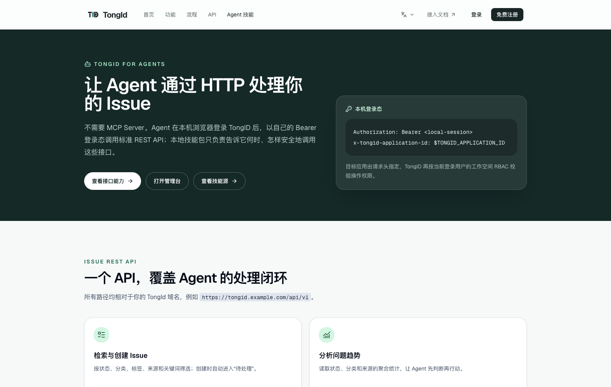
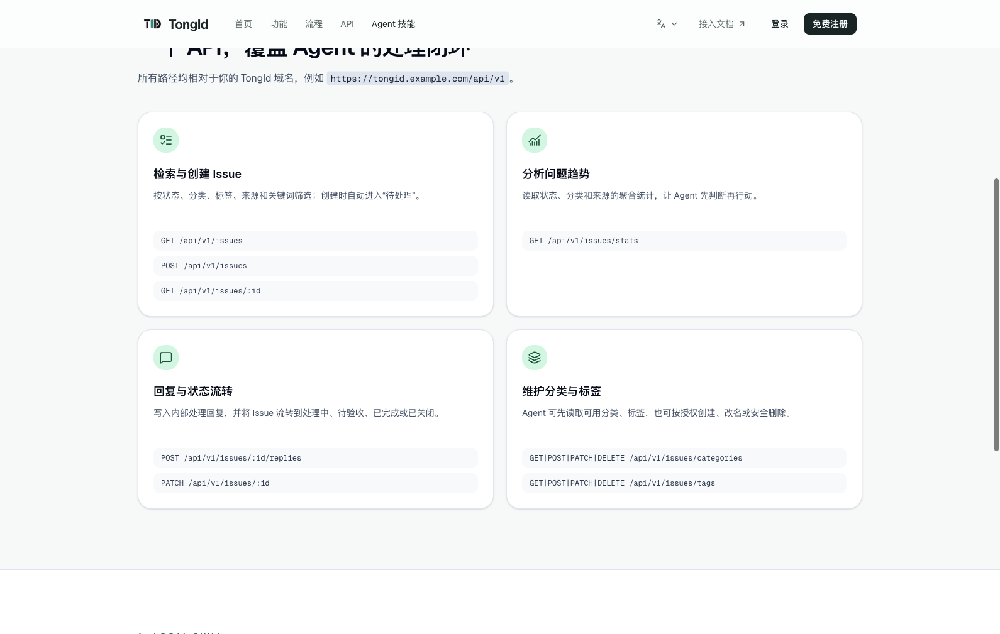
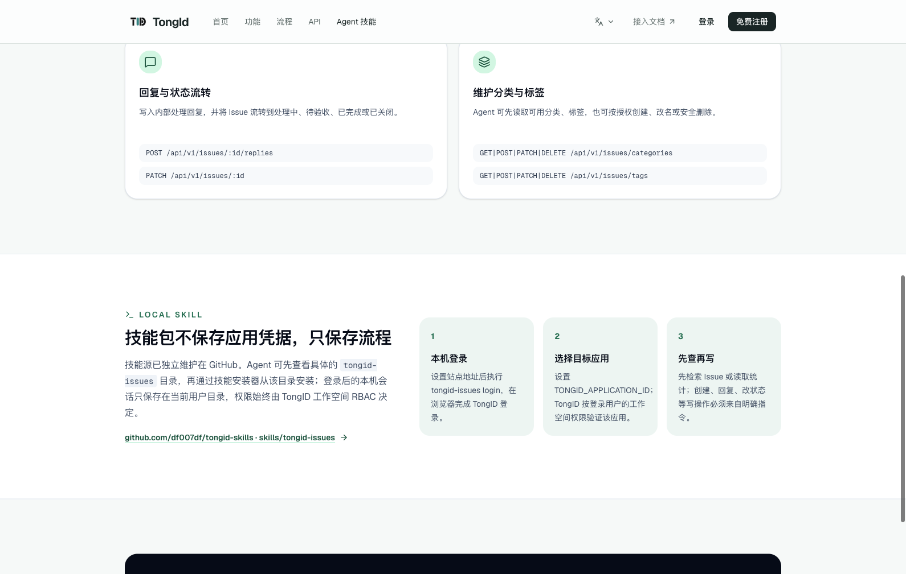

# TongID Skills

TongID 帮你收集用户在软件使用中反馈的问题，并通过管理看板持续跟进。你还可以发布公开看板，让访客看到哪些事项正在处理、已经完成或已关闭，更容易了解产品的最新动向。

这个仓库提供 Agent 技能，让 Agent 也能参与这套问题处理流程。

## Agent 技能

### [tongid-issues](./skills/tongid-issues/)

把日常 Issue 处理交给 Agent。它可以：

- 查询和筛选 Issue
- 汇总问题趋势，找出需要优先处理的事项
- 创建新的 Issue
- 回复处理进度
- 更新处理状态
- 维护分类和标签

适合直接交代给 Agent 的任务，例如：

> 汇总最近一周待处理的问题，按来源和分类告诉我优先级。

> 为这个反馈创建 Issue，并标记为“处理中”。

> 回复这条 Issue：已修复，等待验收。

## 它能帮你做什么

查询、创建和分析问题：

跟进处理进度，并整理分类与标签：

